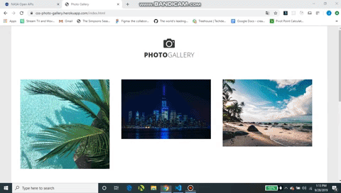

# Interactive Photo Gallery

[View the live demo](https://css-photo-gallery.herokuapp.com/index.html)

If you're interested in viewing my portfolio, [Click here](https://jasonpallone.com)

# Description

This is an interactive photo gallery created using CSS animations and HTML. There are three different types of animations,
all created using CSS animations. There is a zoom in animation, a flip animation and a slide animation. 

# Getting started

To run this project on your PC follow the steps below.

1. Clone this repo to your PC using git clone.
2. Go to this projects directory location on your PC.
3. Open the directory, right click the HTML file and select "Open with"
4. Then select your preferred broswer.
5. The project should now be up and running on your PC in your preferred browser window.

Thanks for checking out my project!
